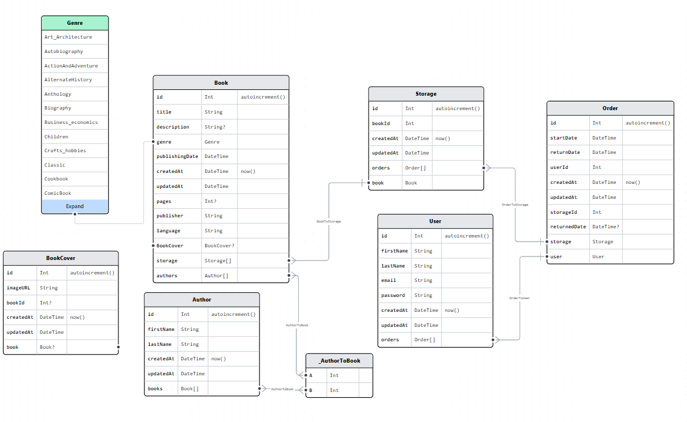

# Dokumentacja projektu nr 2

## Osoby tworzące:

Adam Walka (backend), Michał Myśliwiec (frontend)

# Projekt reserveBook:

## Identyfikacja zagadnienia biznesowego

Celem niniejszego projektu jest stworzenie aplikacji do kompleksowego zarządzania biblioteką książek oraz umożliwienie wygodnego i dostępnego użytkownikom dostępu do usług bibliotecznych. Aplikacja będzie zapewniała różne funkcjonalności, począwszy od użytkowników, którzy chcą korzystać z wypożyczania książek przez internet, aż po pracowników biblioteki odpowiedzialnych za skuteczną obsługę całej placówki. Dla pełnego korzystania z aplikacji, wszyscy użytkownicy będą mieli możliwość prostego zarejestrowania się oraz zalogowania, co pozwoli na dostęp do odpowiednich sekcji aplikacji, dostosowanych do roli użytkownika.

Zwykli użytkownicy będą w stanie przeglądać dostępność książek w bibliotece i wybierać interesujące je pozycje do wypożyczenia. Ponadto, będą mieli możliwość zarezerwowania wybranej książki, umożliwiając odebranie fizycznej kopii w placówce. Administratorzy biblioteki będą mieli pełny wgląd w stan biblioteki, umożliwiając im dodawanie nowych pozycji oraz aktualizowanie stanu magazynowego. Aplikacja w pełni rozwiąże problemy związane z prowadzeniem biblioteki i obsługą klientów. Co więcej, będzie elastyczna i gotowa do ewentualnych rozszerzeń i dostosowania do nowych potrzeb, wynikających z wymagań klienta.

## Wymagania systemowe i funkcjonalne

Projekt w pełni opiera się na architekturze MVC. Modelami w tej strukturze są encje przechowywane w bazie danych PostgreSQL. Kontrolerem aplikacji jest część backendowa zbudowana na frameworku NestJS. Natomiast za zarządzanie widokami odpowiedzialna jest aplikacja frontendowa, wykorzystująca technologię React.

W celu komunikacji między widokiem a kontrolerem zastosowano REST API. Przy połączeniu aplikacji backendowej z bazą danych wykorzystano ORM - Prisma, co zapewnia efektywne i wygodne operacje na danych.

Do stylizacji aplikacji frontendowej użyto narzędzia TailwindCSS, dostarczając estetyczny i spójny wygląd interfejsu użytkownika. W kwestii autoryzacji i autentykacji, projekt opiera się na zastosowaniu tokenów JWT i biblioteki Passport.js, co gwarantuje bezpieczny dostęp i zarządzanie tożsamością użytkowników.

Dodatkowo, w celu przesyłania zdjęć na serwer, wykorzystano bibliotekę Multer, co pozwala na sprawną i wydajną obsługę tego procesu. Całość tej zaawansowanej infrastruktury składa się na funkcjonalną i nowoczesną aplikację do zarządzania biblioteką książek, która spełnia oczekiwania zarówno klientów, jak i pracowników biblioteki.

Funkcjonalności:

1. Podstawowe:
   - Logowanie użytkownika
   - Rejestracja użytkownika
   - Informacje na temat systemu
   - Wyświetlanie listy książek
   - Wyświetlanie informacji na temat pojedynczej książki
   - Wyświetlanie informacji o stanie magazynowym książki
   - Informacje o użytkowniku
2. Funkcje dla klientów:
   - Wyświetlanie informacji na temat aktualnych wypożyczeń
   - Wyświetlanie informacji na temat poprzednich wypożyczeń
   - Możliwość rezerwacji książki
3. Funkcje dla administratora:
   - Wyświetlanie stanu magazynu
   - Wyświetlanie wszystkich aktualnych wypożyczeń
   - Wyświetlanie zakończonych wypożyczeń
   - Wpisanie daty oddania wypożyczenia
   - Dodawanie/Usuwanie/Zmiana książek
   - Dodawanie/Usuwanie/Zmiana stanu magazynowego
   - Dodawanie zdjęć okładek książek
   - Zmiana terminów wypożyczenia
   - Dodawanie/Usuwanie/Zmiana autorów książek

## Analiza zagadnienia i jego modelowanie

Ogólny diagram związków encji



Po otrzymaniu zapytania do serwera, aplikacja serwerowa wybiera odpowiednią ścieżkę prowadzącą do konkretnej metody określonego kontrolera. Kontroler odwołuje się do metod serwisu przypisanego do swojej odpowiedzialności. Serwisy implementują dedykowaną logikę biznesową, korzystając z serwisu biblioteki ORM, który zapewnia dostęp do danych biznesowych. Wynik działania serwisu jest przekazywany z powrotem do kontrolera, który następnie generuje odpowiedź na zapytanie i zwraca wyniki.

Dokumentacja listy zasobów została udokumentowana przy użyciu narzędzia Swagger. Aby uzyskać dostęp do tej dokumentacji, należy wejść na podstronę `/api` na serwerze. Taki sposób dokumentowania ułatwia współpracę pomiędzy stroną backendową i frontendową. Pozwala to na łatwy dostęp i sprawdzenie możliwości aplikacji serwerowej. W związku z licznymi endpointami oraz używanymi encjami, postanowiono nie wypisywać ich szczegółów w niniejszym opisie.

## Implementacja

PostgreSQL został wybrany jako system zarządzania bazą danych w projekcie. Baza danych jest hostowana na platformie wdrożeniowej Railway. Wybór takiej opcji wynika z ułatwienia wspólnego dostępu dla obu członków zespołu projektowego. Dzięki temu rozwiązaniu możliwe jest korzystanie z tych samych danych oraz zapewnienie jednolitego odzwierciedlenia w encjach.

W celu nawiązania połączenia z bazą danych, wykorzystano ORM o nazwie Prisma. W trakcie instalacji projektu generowany jest folder o nazwie `prisma`, zawierający kluczowe elementy, takie jak źródło danych, generator oraz model danych. Właśnie dzięki temu narzędziu możliwe jest wygodne zarządzanie danymi, zapewniając spójność oraz efektywność w obszarze odzwierciedlenia informacji w aplikacji. Poniżej przedstawiono fragment kodu, w którym uwzględnione zostały wymienione wyżej składowe:

```js
generator client { provider = "prisma-client-js" }
datasource db { provider = "postgresql", url = env("DATABASE_URL") }
model Storage {
  id        Int      @id @default(autoincrement())
  bookId    Int
  createdAt DateTime @default(now())
  updatedAt DateTime @updatedAt
  orders    Order[]
  book      Book     @relation(fields: [bookId], references: [id])
}
```

Po stronie serwera, w projekcie zastosowano bibliotekę NestJS, która opiera się na bibliotece Express i wykorzystuje środowisko Node.js. W celu korzystania z ORM-a, należy stworzyć folder o nazwie `prisma`, a także odpowiednie moduły i serwisy. Moduł jest potrzebny do dalszego wykorzystania instancji napisanego serwisu. Serwis będzie rozszerzał interfejs `PrismaClient` i zaimplementuje metodę `OnModuleInit`, co pozwoli na zachowanie serwisu jako singleton. Poniżej znajduje się implementacja serwisu:

```js
export class PrismaService extends PrismaClient implements OnModuleInit {
  async onModuleInit() { await this.$connect(); }
}
```

Główny moduł, oznaczony jako MainModule, jest punktem wyjścia aplikacji. W module tym deklarujemy kontrolery i usługi, a także inne moduły dostawców, jak na przykład PrismaService wykorzystany do korzystania z Prisma ORM.

Moduł ten jest kluczowym elementem struktury aplikacji w NestJS. Umożliwia zbudowanie wewnętrznego grafu aplikacji, co pozwala na łatwe rozwiązywanie relacji i zależności między różnymi modułami i dostawcami. Jest to przydatne, gdy aplikacja staje się bardziej złożona i wymaga zarządzania wieloma elementami, takimi jak kontrolery, serwisy, filtry, middleware itp.

```js
@Module({
  imports: [ PrismaModule, BookModule, AuthorModule, UserModule, AuthModule, OrderModule, StorageModule, CoverModule,
    ServeStaticModule.forRoot(
      (() => {
        const publicDir = resolve("./files/");
        const servePath = "/files";
        return { rootPath: publicDir, serveRoot: servePath, exclude: ["/api*"], };
      })()
    ),
  ],
```

Plik main.ts stanowi kluczowy punkt inicjalizacji całej aplikacji w frameworku NestJS. To tutaj importowany jest główny moduł, który pełni rolę punktu wejścia do struktury aplikacji.

W większości przypadków, zasoby takie jak kontrolery, serwisy oraz połączenie z bazą danych, wykazują podobną strukturę i budowę. Kontroler odpowiada za odbiór informacji zawartych w zapytaniu i przekazuje je do serwisu. Serwis, z kolei, komunikuje się z bazą danych za pomocą serwisu ORM, a otrzymane dane są na końcu zwracane w odpowiedzi.

Ta spójność w budowie i strukturze zasobów pomaga w utrzymaniu czytelności i uporządkowania kodu, co przyczynia się do zwiększenia łatwości zarządzania oraz rozwoju aplikacji w frameworku NestJS. Poniżej znajduje się przykład struktury dla funkcji tworzenia książki, który ilustruje typową architekturę kontrolera, serwisu i ORM w aplikacji NestJS:

```js
  @ApiCreatedResponse({ type: BookEntity })
  async createBook(@Body() createBookDto: CreateBookDto) {
    return new BookEntity(await this.bookService.createBook(createBookDto));
  }
```

```js
  async createBook(createBookDto: CreateBookDto) {
    return this.prisma.book.create({
      data: { createBookDto, authors: { connect: authorsIds.map((authorId) => ({ id: authorId })), }, },
    });
  }
```

Poniżej przedstawiona jest funkcja logowania, która stanowi ważny element projektu w zakresie autentykacji. Funkcja ta obsługuje proces uwierzytelniania użytkownika w aplikacji.

```js
async login(email: string, password: string): Promise<AuthEntity> {
    const user = await this.prisma.user.findUnique({ where: { email: email } });
    if (!user) {
      throw new NotFoundException();
    }
    const isPasswordValid = await bcrypt.compare(password, user.password);
    if (!isPasswordValid) {
      throw new UnauthorizedException();
    }
    return {
      accessToken: this.jwtService.sign({ id: user.id, firstName: user.firstName, lastName: user.lastName, email: user.email }),
    };
  }
```

W pierwszym etapie następuje weryfikacja, czy podany użytkownik istnieje w systemie. Jeśli użytkownik nie istnieje, zwracany jest kod błędu "Not Found". Następnie sprawdzane jest, czy podane hasło jest zgodne z hasłem przechowywanym w bazie danych dla tego użytkownika. W przypadku nieprawidłowego hasła, aplikacja zwraca błąd autoryzacji. W przeciwnym razie generowany jest podpisany token JWT, zawierający podstawowe informacje o użytkowniku.

Aby umożliwić uwierzytelnianie przy użyciu JWT, aplikacja wykorzystuje wbudowany serwis `JwtService` dostępny w NestJS. Serwis ten jest zainicjalizowany w module zasobu "auth". Dodatkowo używana jest strategia `PassportStrategy` z biblioteki Passport, która przechwytuje i waliduje przesyłany token JWT.

Kolejnym istotnym zasobem jest funkcjonalność wysyłania i pobierania zdjęć okładek książek. Główny element tej funkcji to konfiguracja biblioteki Multer, która odpowiada za przetwarzanie i przechwytywanie przesyłanego pliku na serwer. W opcjach konfiguracyjnych przekazywane są różne parametry, takie jak limit wielkości pliku (np. 5 MB), filtracja odpowiednich rozszerzeń plików i określenie, w jaki sposób mają być przechowywane na serwerze. Te opcje są używane w dekoratorze endpointu `@UseInterceptors(FileInterceptor('cover', multerOptions))`, który pozwala na korzystanie z funkcjonalności biblioteki Multer w odpowiednim miejscu aplikacji.

Strona klienta wykorzystuje bibliotekę React wraz z dodatkowymi narzędziami, które umożliwiają rozbudowane i efektywne tworzenie interfejsu użytkownika. Poniżej znajduje się przegląd używanych bibliotek i komponentów:
  - React Router: Jest wykorzystywany do zarządzania trasowaniem w aplikacji, co pozwala na dynamiczne renderowanie komponentów w zależności od ścieżki URL. 
  - TailwindCSS i DaisyUI: Te biblioteki odpowiedzialne są za stylizację i wygląd całej aplikacji. TailwindCSS zapewnia podstawowe komponenty stylizacyjne, natomiast DaisyUI dostarcza dodatkowe gotowe komponenty, które ułatwiają tworzenie interfejsu użytkownika.
  - Zustand: Jest to biblioteka zarządzania stanem aplikacji, która umożliwia przechowywanie i udostępnianie stanu w całej aplikacji, dzięki czemu komponenty mogą łatwo komunikować się i współdzielić dane.
  - React Query: Ta biblioteka dostarcza narzędzia do łatwego i wydajnego fetchowania danych z serwera. Umożliwia również cache'owanie danych, odświeżanie i automatyczne ponawianie zapytań.
  - React Hook Form: Jest to biblioteka do zarządzania formularzami, która ułatwia walidację, obsługę pól formularza oraz przesyłanie danych.

Plikem inicjalizującym aplikację na stronie klienta jest main.tsx, który jest odpowiednikiem pliku main.ts po stronie serwera. W tym pliku znajdują się providery, które odpowiedzialne są za zarządzanie stanem, routing za pomocą biblioteki React Router oraz fetchowanie danych przy użyciu React Query.

W głównym pliku aplikacji, czyli App.jsx, zdefiniowane są podstawy routingu, czyli trasy, które decydują o renderowaniu odpowiednich komponentów w zależności od ścieżki URL. W tym pliku znajduje się również funkcja, która obsługuje prywatne trasy, czyli dostęp do określonych stron wymagający uwierzytelnienia.

Dodatkowo, w tym pliku utrzymywany jest stan zalogowania użytkownika poprzez odczytanie tokenu JWT z local storage, co pozwala na zapewnienie odpowiednich uprawnień i funkcjonalności dla zalogowanych użytkowników.
```jsx
  return (
    <Routes>
      <Route path="/" element={<Layout />}>
        <Route index element={<HomePage />} />
        <Route path="books">
          <Route index element={<BookOverviewPage />} />
          <Route path=":bookId" element={<BookPage />} />
        </Route>
        <Route path="user">
          <Route index element={ <PrivateRoute> <UserPage /> </PrivateRoute> }/>
```

Zustand
```js
export const useUserStore = create<State & Actions>()((set) => ({
  ...initialState,
  setUser: (user: User) => { set({ ...user }); },
  reset: () => { set(initialState); },
}));
```

React Router 
```js
const { data: book, isLoading, isError, } = useQuery({ queryKey: ["book"], queryFn: async () => getBook(bookId as string), });
```

React Hook Form 
```jsx
 const { register, handleSubmit, formState: { errors } } = useForm<SignInUser>();
  return (
    <div className="card flex-shrink-0 shadow-2xl bg-base-100 w-96">
      <div className="card-body">
        <form onSubmit={handleSubmit(signIn)} className="form-control">
          <div className="">
            <label className="label">
              <span className="label-text">Email</span>
            </label>
            <input type="email" className="input input-bordered w-11/12" placeholder="email" {...register("email", { required: true, minLength: 8 })} />
```

## Podsumowanie

Aplikacja została wdrożona zgodnie z zawężonymi wymaganiami biznesowymi, umożliwiając użytkownikom łatwiejszy dostęp do wypożyczania książek. Obejmuje funkcjonalności zarówno z części podstawowej, jak i z aplikacji klienckiej. W części serwerowej zaimplementowano wszystkie główne funkcje, jednak stworzenie części administratorskiej po stronie klienta wymagałoby znacznego nakładu pracy, co praktycznie równałoby się tworzeniu osobnej aplikacji.

Podczas prac nad backendem, pojawiły się pewne wyzwania, w tym obsługa tokenów JWT i biblioteki Passport oraz przetwarzanie i umieszczanie zdjęć okładek na serwerze. Dodatkowo, budowanie bardziej zaawansowanej struktury bazy danych było trudne z powodu ograniczonej wiedzy i doświadczenia w tym obszarze.

W przypadku frontendu, niektóre problemy pojawiły się przy korzystaniu z biblioteki TailwindCSS, która, mimo odzwierciedlenia klas CSS, wymaga innego podejścia do pisania stylów. Początkowo również napotkano trudności z biblioteką React Query.

Warto podkreślić, że rozwój aplikacji powinien następować w kierunku stworzenia części administratorskiej. Wśród możliwych rozszerzeń funkcjonalności znajduje się dodanie encji kategorii, umożliwienie filtrowania po autorach czy dodanych kategoriach, analiza i śledzenie zachowań użytkowników, a także udostępnienie wersji PDF książek z otwartych źródeł.
